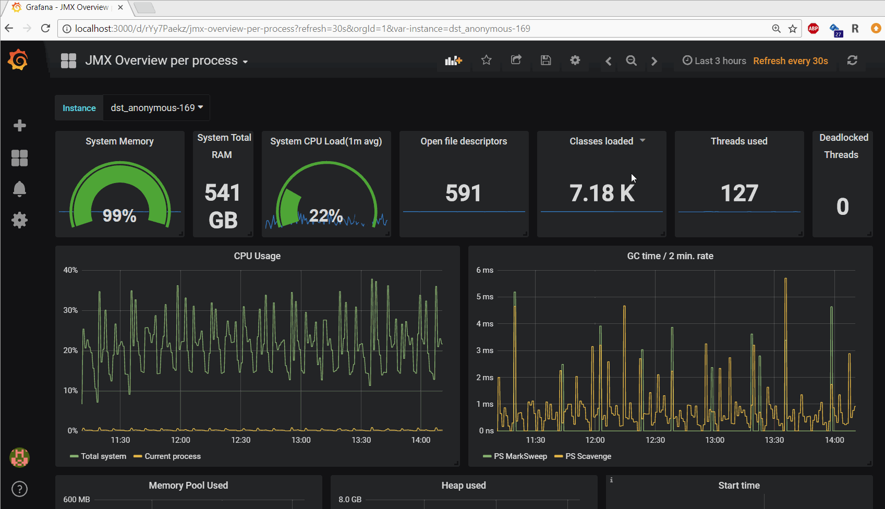

# Grafana reporter 

A simple http service that generates \*.PDF reports from [Grafana](http://grafana.org/) dashboards.

## Requirements

Runtime requirements

- `pdflatex` installed and available in PATH.
- a running Grafana instance that it can connect to. If you are using an old Grafana (version < v5.0), see `Deprecated Endpoint` below.

Build requirements:

- [golang](https://golang.org/)

## Getting started

### Build and run

Get the source files and dependencies:

    go get github.com/IzakMarais/reporter/...

Build and install `grafana-reporter` binary to `$GOPATH/bin`:

    go install -v github.com/IzakMarais/reporter/cmd/grafana-reporter

Running without any flags assumes Grafana is reachable at `localhost:3000`:

    grafana-reporter

Query available flags. Likely the only one you need to set is `-ip`. 

    grafana-reporter --help
    -cmd_apiKey string
          Grafana api key. Required (and only used) in command line mode.
    -cmd_apiVersion string
          Api version: [v4, v5]. Required (and only used) in command line mode, example: -apiVersion v5. (default "v5")
    -cmd_dashboard string
          Dashboard identifier. Required (and only used) in command line mode.
    -cmd_enable
          Enable command line mode. Generate report from command line without starting webserver (-cmd_enable=1).
    -cmd_o string
          Output file. Required (and only used) in command line mode. (default "out.pdf")
    -cmd_template string
          Specify a custom TeX template file. Only used in command line mode, but is optional even there.
    -cmd_ts string
          Time span. Required (and only used) in command line mode. (default "from=now-3h&to=now")
    -grid-layout
          Enable grid layout (-grid-layout=1). Panel width and height will be calculated based off Grafana gridPos width and height.
    -ip string
          Grafana IP and port. (default "localhost:3000")
    -port string
          Port to serve on. (default ":8686")
    -proto string
          Grafana Protocol. Change to 'https://' if Grafana is using https. Reporter will still serve http. (default "http://")
    -ssl-check
          Check the SSL issuer and validity. Set this to false if your Grafana serves https using an unverified, self-signed certificate. (default true)
    -templates string
          Directory for custom TeX templates. (default "templates/")

### Generate a dashboard report

#### Endpoint

The reporter serves a pdf report on the specified port at:

    /api/v5/report/{dashboardUID}

where `{dashboardUID}` is the dashboard uid as used in the Grafana dashboard's URL.
E.g. `SoT6hL6zk` from `http://grafana-host:3000/d/SoT6hL6zk/descriptive-name`.
For more about this uid, see [the Grafana HTTP API](http://docs.grafana.org/http_api/dashboard/#identifier-id-vs-unique-identifier-uid).

#### Deprecated Endpoint

In Grafana v5.0, the Grafana HTTP API for dashboards was changed. The reporter still works with the previous Grafana API too, but serves pdf reports at a different endpoint.
So, if you use Grafana v4, you need to download your reports from here instead:

    /api/report/{dashboardname}

where `{dashboardname}` is the same name as used in the Grafana v4 dashboard's URL.
E.g. `backend-dashboard` from `http://grafana-host:3000/dashboard/db/backend-dashboard`.
This endpoint is deprecated and may be dropped in a future release of the grafana-reporter.

#### Query parameters

The endpoint supports the following optional query parameters. These can be combined using standard
URL query parameter syntax, eg:

    /api/v5/report/{dashboardUID}?apitoken=12345&var-host=devbox

**Time span**: The time span query parameter syntax is the same as used by Grafana.
When you create a link from Grafana, you can enable the _Time range_ forwarding check-box.
The link will render a dashboard with your current time range.  
By default, the time range will be included as the report sub-title. 
Times are displayed using the reporter's host server time zone. 

**variables**: The template variable query parameter syntax is the same as used by Grafana.
When you create a link from Grafana, you can enable the _Variable values_ forwarding check-box.
The link will render a dashboard with your current variable values.

**apitoken**: A Grafana authentication api token. Use this if you have auth enabled on Grafana. 
Syntax: `apitoken={your-tokenstring}`. If you are getting `Got Status 401 Unauthorized, message: {"message":"Unauthorized"}`
error messages, typically it is because you forgot to set this parameter. 

**template**: Optionally specify a custom TeX template file.
Syntax `template=templateName` implies the grafana-reporter should have access to a template file on the server at `templates/templateName.tex`.
The `templates` directory can be set with a command line parameter.
See the LaTeX code in `texTemplate.go` as an example of what variables are available and how to access them.
Also see [this issue](https://github.com/IzakMarais/reporter/issues/50) for an example. 

### Command line mode

If you prefer to generate a report directly from the command line without running a webserver,
command line mode enables this. All flags related to command line mode are
prefixed with `cmd_` to distinguish them from regular flags:

    grafana-reporter -cmd_enable=1 -cmd_apiKey [api-key] -ip localhost:3000 -cmd_dashboard ITeTdN2mk -cmd_ts from=now-1y -cmd_o out.pdf

### Docker examples (optional)

A Docker image [is available](https://hub.docker.com/r/izakmarais/grafana-reporter/). To see available flags:

    docker run izakmarais/grafana-reporter --help

To run with default flags, use `--net` to enable Docker to connect to Grafana at `localhost:3000`:

    docker run -p 8686:8686 --net="host" izakmarais/grafana-reporter

If you also have `Make` and `Docker-compose` installed, you can run a simple local orchestration of Grafana and Grafana-reporter:

     go get github.com/IzakMarais/reporter/ ...
     cd $GOPATH/src/github.com/IzakMarais/reporter
     make compose-up

Then open a browser to `http://localhost:3000` and create a new test dashboard. Add the example graph and save the dashboard.
Observe the new URL and find the dashboard UID, e.g. `qaJCuCezz` from `http://localhost:3000/d/qaJCuCezz/new-dashboard-copy`
Next, go to: `http://localhost:8080/api/v5/report/qaJCuCezz`, which will output the grafana-reporter PDF.

## Development

### Test

The unit tests can be run using the go tool:

    go test -v github.com/IzakMarais/reporter/...

or, the [GoConvey](http://goconvey.co/) webGUI:

    ./bin/goconvey -workDir `pwd`/src/github.com/IzakMarais -excludedDirs `pwd`/src/github.com/IzakMarais/reporter/tmp/

### Release

A new release requires changes to the git tag, `cmd/grafana-reporter/version.go` and `Makefile: docker-build` job.

Build the Docker image and push to Dockerhub. Build the Windows and Linux binaries and upload to Github
using `make buildall`. 
